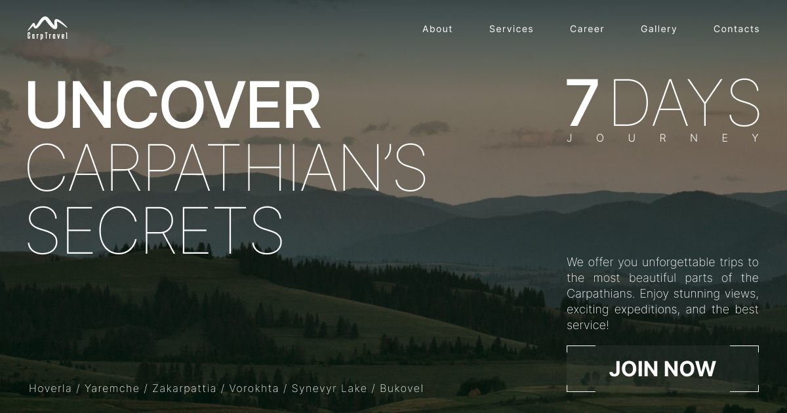

# Landing page for Carp Travel

**[View live page](https://carp-travel-livid.vercel.app)**

---

## 🗂️ Project description 🗂️

## Goals

Implement the Carp Travel landing page according to the technical specifications.

## Used Technologies:

- Next.js
- TypeScript
- Tailwind

## Acceptance Criteria

- The layout is fixed in pixels.
- Semantic and valid markup; accessibility (a11y) is a bonus.
- Responsive and cross-browser layout:
  - Mobile: 360px to 480px (fluid layout, should stretch);
  - Tablet: 768px;
  - Desktop: 1280px.
- Utilize the Mobile-First approach.
- Clean code with preserved formatting. Consider using ESLint/Prettier.
- Code is divided into separate components.
